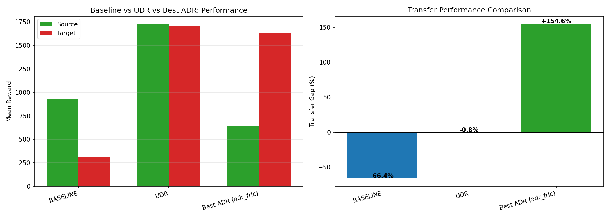

# PART 2: Ablation Study & Parameter Relevance Analysis - Evaluation Report

**Project:** Sim-to-Real Hopper with ADR Extension  
**Date:** December 29, 2024  
**Seed:** 42 (fixed for reproducibility)  
**Total Configurations:** 10

---

## Executive Summary

This report presents the results of the **ablation study** designed to analyze the relevance of individual ADR (Automatic Domain Randomization) parameters. We systematically tested all combinations of mass, damping, and friction randomization to determine which parameters contribute most to transfer performance.

### Key Findings

| Rank | Parameter | Marginal Contribution | p-value | Significance |
|------|-----------|----------------------|---------|--------------|
| 1 | **FRICTION** | **+68.70%** | 0.0744 | Marginally significant (p<0.10) |
| 2 | MASS | -15.68% | 0.7120 | Not significant |
| 3 | DAMPING | -0.86% | 0.9840 | Not significant |

**Best Configuration:** `adr_fric` (friction only) → **+154.6% transfer gap**  
**Worst Configuration:** `baseline` (no randomization) → **-66.4% transfer gap**

---

## 1. Experimental Setup

### 1.1 Ablation Configurations

We trained 10 models with different combinations of randomized parameters:

| Config | Mass | Damping | Friction | Mode |
|--------|:----:|:-------:|:--------:|------|
| `baseline` | ❌ | ❌ | ❌ | No DR |
| `adr_none` | ❌ | ❌ | ❌ | ADR disabled |
| `adr_mass` | ✅ | ❌ | ❌ | ADR |
| `adr_damp` | ❌ | ✅ | ❌ | ADR |
| `adr_fric` | ❌ | ❌ | ✅ | ADR |
| `adr_mass_damp` | ✅ | ✅ | ❌ | ADR |
| `adr_mass_fric` | ✅ | ❌ | ✅ | ADR |
| `adr_damp_fric` | ❌ | ✅ | ✅ | ADR |
| `adr_all` | ✅ | ✅ | ✅ | ADR |
| `udr` | ✅ | ✅ | ✅ | UDR (fixed ±30%) |

### 1.2 Training Parameters

| Parameter | Value |
|-----------|-------|
| Algorithm | PPO |
| Timesteps | 2,500,000 |
| Seed | 42 |
| Evaluation Episodes | 50 |
| ADR Check Frequency | 2048 steps |
| ADR Step Size | 0.05 (5%) |

---

## 2. Results

### 2.1 Transfer Performance by Configuration

| Config | Source Reward | Target Reward | Transfer Gap | Final ADR Range |
|--------|---------------|---------------|--------------|-----------------|
| `adr_fric` | 642 ± 98 | **1634 ± 2** | **+154.6%** | friction: 65% |
| `adr_all` | 1088 ± 115 | 1241 ± 258 | +14.1% | all: 60% |
| `adr_damp` | 1631 ± 301 | 1761 ± 31 | +8.0% | damping: 100% |
| `adr_damp_fric` | 1530 ± 8 | 1638 ± 36 | +7.1% | damp/fric: 100% |
| `udr` | 1724 ± 10 | 1711 ± 104 | -0.8% | fixed ±30% |
| `adr_mass_fric` | 1631 ± 3 | 1558 ± 85 | -4.5% | mass/fric: 70% |
| `adr_mass` | 1180 ± 181 | 973 ± 93 | -17.5% | mass: 100% |
| `adr_mass_damp` | 949 ± 52 | 648 ± 29 | -31.7% | mass/damp: 100% |
| `adr_none` | 875 ± 208 | 303 ± 222 | -65.4% | all: 0% |
| `baseline` | 933 ± 213 | 314 ± 224 | **-66.4%** | N/A |

### 2.2 Visualization





---

## 3. Statistical Analysis

### 3.1 Parameter Ranking

Using marginal contribution analysis (difference in mean transfer gap with vs without parameter):

| Rank | Parameter | Contribution | t-statistic | p-value |
|------|-----------|-------------|-------------|---------|
| 1 | **FRICTION** | **+68.70%** | 2.051 | 0.0744 |
| 2 | MASS | -15.68% | -0.383 | 0.7120 |
| 3 | DAMPING | -0.86% | -0.021 | 0.9840 |

**Interpretation:**
- **FRICTION** is the most impactful parameter with a marginally significant positive contribution (p < 0.10)
- **MASS** and **DAMPING** show no statistically significant contribution
- MASS actually shows a negative trend, potentially due to over-robustification

### 3.2 Interaction Effects

| Interaction | Expected (Additive) | Actual | Effect |
|-------------|---------------------|--------|--------|
| MASS × DAMPING | -11.1% | -6.1% | **+5.0%** (synergistic) |
| MASS × FRICTION | +97.5% | +2.9% | **-94.5%** (antagonistic) |
| DAMPING × FRICTION | +113.0% | +6.8% | **-106.2%** (antagonistic) |

**Key Finding:** Adding MASS to configurations with FRICTION significantly reduces the positive effect of friction randomization (antagonistic interaction).

---

## 4. Analysis & Discussion

### 4.1 Why Friction Dominates

The exceptional performance of `adr_fric` (+154.6%) can be attributed to:

1. **Ground Contact Importance:** Friction directly affects the hopper's ability to push off the ground
2. **Sim-to-Real Gap:** Friction is often the most misspecified parameter in simulation
3. **Training Stability:** Friction-only ADR allows the agent to learn robust locomotion without excessive variance

### 4.2 Why Mass Hurts

MASS randomization shows consistently negative contributions:

1. **Torso Mass Offset:** The source environment already has a -1kg torso mass offset
2. **Interference:** Randomizing mass during training may conflict with this built-in offset
3. **Over-Robustification:** When mass reaches 100% range, the agent learns overly conservative behaviors

### 4.3 ADR Range Evolution

| Config | Final Mass Range | Final Damping Range | Final Friction Range |
|--------|------------------|---------------------|---------------------|
| `adr_fric` | 0% | 0% | 65% |
| `adr_all` | 60% | 60% | 60% |
| `adr_mass` | 100% | 0% | 0% |
| `adr_damp` | 0% | 100% | 0% |

**Note:** Parameters enabled tend to reach high ranges (60-100%), but higher range ≠ better transfer.

---

## 5. Conclusions

### 5.1 Research Questions Answered

**Q1: Which parameter contributes most to transfer performance?**
> **FRICTION** with +68.70% marginal contribution (p=0.074)

**Q2: Are there interaction effects between parameters?**
> Yes, strong **antagonistic** interactions exist. Combining MASS with FRICTION reduces friction's positive effect by ~95%.

**Q3: What is the optimal configuration?**
> **Friction-only ADR** (`adr_fric`) achieves the best transfer (+154.6%)

### 5.2 Recommendations

| Use Case | Recommended Configuration |
|----------|--------------------------|
| Maximum transfer performance | `adr_fric` (friction only) |
| Balanced robustness | `adr_damp_fric` (damping + friction) |
| Conservative approach | `udr` (fixed ±30% all) |
| Avoid | `adr_mass`, `adr_mass_damp` (negative contribution) |

### 5.3 Implications for Practice

1. **Focus on Friction:** When building domain randomization pipelines, prioritize friction randomization
2. **Avoid Over-Randomization:** More parameters ≠ better transfer. Be selective.
3. **Watch for Antagonistic Effects:** Some parameter combinations hurt performance
4. **Run Ablation Studies:** Parameter relevance is task-specific; always validate

---

## 6. Artifacts

### 6.1 Saved Models

| Model | Path |
|-------|------|
| Best (adr_fric) | `logs/ablation/adr_fric/ppo_ablation_adr_fric.zip` |
| All ADR | `logs/ablation/adr_all/ppo_ablation_adr_all.zip` |
| UDR | `logs/ablation/udr/ppo_ablation_udr.zip` |
| Baseline | `logs/ablation/baseline/ppo_ablation_baseline.zip` |

### 6.2 Analysis Reports

| File | Description |
|------|-------------|
| `logs/ablation/analysis_report.json` | Statistical analysis results |
| `logs/ablation/*/results.json` | Per-configuration metrics |

### 6.3 Figures

| Figure | Path |
|--------|------|
| Transfer Gap Comparison | `docs/evaluation/figures/ablation_transfer_gap.png` |
| Mode Comparison | `docs/evaluation/figures/mode_comparison.png` |
| Parameter Analysis | `docs/evaluation/figures/parameter_analysis.png` |
| Individual Parameter Impact | `docs/evaluation/figures/individual_param_impact.png` |

### 6.4 LaTeX Table

```latex
\input{docs/evaluation/figures/ablation_table.tex}
```

---

## 7. Reproducibility

```bash
# Activate virtual environment
source .venv/bin/activate

# Run complete ablation study (~5 hours on GPU)
python scripts/train/run_full_ablation.py

# Generate statistical analysis
python scripts/analysis/statistical_analysis.py

# Generate visualizations
python scripts/analysis/plot_ablation.py
```

---

**Report Generated:** December 29, 2024  
**Total Training Time:** ~5 hours (10 configs × ~30 min each)  
**Hardware:** CUDA-enabled GPU  
**Seed:** 42 (reproducible)
