# GUIDA COMPLETA "ZERO-TO-HERO": SIM-TO-REAL HOPPER CON AUTOMATIC DOMAIN RANDOMIZATION (ADR)

**Versione:** 5.0 (Team Edition - 2 Membri)  
**Obiettivo:** Unica fonte di verità per l'implementazione, il training e la relazione finale del progetto.  
**Stato:** Definitivo per l'esame.

---

## STRUTTURA DEL TEAM

Questo progetto è suddiviso tra **2 membri** con ruoli distinti ma complementari. I membri possono lavorare **in parallelo** grazie alla separazione delle responsabilità.

| Ruolo | Responsabilità Principale | Sezioni di Competenza |
|-------|---------------------------|----------------------|
| **Membro 1** | Core RL & Ambiente | Fase 1 (CustomHopper), Fase 2 (ADR Callback), Debug |
| **Membro 2** | Integrazione & DevOps | Setup, Fase 3 (Training Loop), Esecuzione, Analisi |

> [!IMPORTANT]
> **Prerequisito comune:** Entrambi i membri devono leggere la [Sezione 1 - Il Concetto ADR](#1-il-concetto-perché-adr) prima di iniziare.

---

## INDICE

**Prerequisiti (Entrambi i membri)**
1.  [Il Concetto: Perché ADR?](#1-il-concetto-perché-adr)

**Membro 1 - Core RL & Ambiente**
2.  [Fase 1: Il Motore Fisico (CustomHopper)](#2-fase-1-il-motore-fisico-customhopper)
3.  [Fase 2: Il Cervello (ADR Callback)](#3-fase-2-il-cervello-adr-callback)
4.  [File di Debug](#4-file-di-debug)

**Membro 2 - Integrazione & DevOps**
5.  [Setup dell'Ambiente di Lavoro](#5-setup-dellambiente-di-lavoro)
6.  [Fase 3: Il Training Loop (Main Script)](#6-fase-3-il-training-loop-main-script)
7.  [Esecuzione e Monitoraggio](#7-esecuzione-e-monitoraggio)
8.  [Analisi dei Risultati e Scrittura della Relazione](#8-analisi-dei-risultati-e-scrittura-della-relazione)

---

# PREREQUISITI (ENTRAMBI I MEMBRI)

---

## 1. IL CONCETTO: PERCHÉ ADR?

> [!NOTE]
> Questa sezione è **obbligatoria per entrambi i membri**. Comprendere la teoria è essenziale per implementare correttamente sia l'ambiente (Membro 1) che il training loop (Membro 2).

### 1.1 Il problema: Il Paradosso del Sim-to-Real
Addestrare robot in simulazione (Sim) per farli agire nel mondo reale (Real) è difficile a causa del **Reality Gap**.
*   **Approccio Naive:** Addestrare su un modello fisso. **Risultato:** Fallimento catastrofico nel reale (Overfitting alla simulazione).
*   **Approccio Base (UDR - Uniform Domain Randomization):** Randomizzare parametri (massa, attrito) entro range fissi. 
    *   *Problema A (Range stretti):* Non copre la realtà.
    *   *Problema B (Range ampi):* Genera scenari impossibili ("ghiaccio puro"), l'agente non impara nulla (*Learned Helplessness*).

### 1.2 La soluzione: Automatic Domain Randomization (ADR)
L'ADR trasforma il training in un **curriculum automatico**. Immagina un cerchio di competenza che si allarga:
1.  Si parte da un ambiente deterministico (facile).
2.  Se l'agente è bravo (**Reward alto**), l'ambiente diventa più ostile (aumenta randomizzazione).
3.  Se l'agente fallisce (**Reward basso**), l'ambiente diventa più clemente (diminuisce randomizzazione).

**Obiettivo finale:** Ottenere una policy che sopravvive alla massima entropia (caos) possibile. Questa è la definizione operativa di "Robustezza".

---

# MEMBRO 1 - CORE RL & AMBIENTE

> [!IMPORTANT]
> **Responsabilità:** Implementare il motore fisico ADR (`custom_hopper.py`) e la callback di controllo (`adr_callback.py`). Questi componenti sono **indipendenti** dal training loop e possono essere sviluppati in parallelo.

---

## 2. FASE 1: IL MOTORE FISICO (`custom_hopper.py`)

**Ruolo:** Estendere l'ambiente base per supportare l'ADR. Il file `env/custom_hopper.py` contiene già l'implementazione completa dell'Hopper (step, reward, health check, registrazione gym). Dobbiamo aggiungere:
1. Salvataggio dei valori nominali di **Damping** e **Friction**
2. Stato ADR (`adr_state`)
3. Metodi ADR (`update_adr`, `get_adr_info`)
4. Estensione di `sample_parameters` e `set_parameters`

**Il file base è già presente in `env/custom_hopper.py`.** Qui sotto sono documentate le **sole modifiche da implementare**.

---

### 2.1 Modifiche all'`__init__`

Dopo l'inizializzazione esistente, aggiungere il salvataggio dei valori nominali e lo stato ADR:

```python
# --- ADR EXTENSION: Initialization ---
# Salvataggio valori nominali per Damping e Friction (oltre alla massa già salvata)
self.original_damping = np.copy(self.model.dof_damping)
self.original_friction = np.copy(self.model.geom_friction)

# Stato ADR: delta di randomizzazione (iniziano a 0 = ambiente deterministico)
self.adr_state = {
    "mass_range": 0.0,      
    "damping_range": 0.0,   
    "friction_range": 0.0   
}

# Iperparametri ADR
self.adr_step_size = 0.05     # Step di incremento/decremento (5%)
self.min_friction_floor = 0.3 # Safe-guard: sotto 0.3 è impossibile camminare
```

---

### 2.2 Estensione di `sample_parameters`

Modificare il metodo esistente per restituire un **dizionario** con massa, damping e friction:

```python
def sample_parameters(self):
    """
    Genera un nuovo set di parametri fisici basati sulla difficoltà (adr_state) attuale.
    Estende la logica base randomizzando non solo massa ma anche attrito e damping.
    
    Returns:
        dict: Dizionario con chiavi "masses", "damping", "friction"
    """
    params = {}
    
    # A. MASSA
    m_delta = self.adr_state["mass_range"]
    m_scale = self.np_random.uniform(1.0 - m_delta, 1.0 + m_delta, size=self.original_masses.shape)
    # Nota: original_masses è [1:], quindi dobbiamo gestire l'offset
    params["masses"] = self.original_masses * m_scale

    # B. DAMPING
    d_delta = self.adr_state["damping_range"]
    d_scale = self.np_random.uniform(max(0.1, 1.0 - d_delta), 1.0 + d_delta, size=self.original_damping.shape)
    params["damping"] = self.original_damping * d_scale

    # C. FRICTION
    f_delta = self.adr_state["friction_range"]
    f_scale = self.np_random.uniform(max(self.min_friction_floor, 1.0 - f_delta), 1.0 + f_delta, size=(self.original_friction.shape[0], 1))
    new_friction = self.original_friction.copy()
    new_friction[:, 0] = self.original_friction[:, 0] * f_scale.flatten()
    params["friction"] = new_friction
    
    return params
```

---

### 2.3 Estensione di `set_parameters`

Modificare per accettare il dizionario e applicare tutti i parametri:

```python
def set_parameters(self, params):
    """Applica i parametri fisici al motore MuJoCo."""
    if isinstance(params, dict):
        # Versione ADR
        self.model.body_mass[1:] = params["masses"]
        self.model.dof_damping[:] = params["damping"]
        self.model.geom_friction[:] = params["friction"]
    else:
        # Retrocompatibilità con versione base (lista di masse)
        self.model.body_mass[1:] = params
```

---

### 2.4 Nuovo metodo `update_adr`

Aggiungere questo metodo che sarà chiamato dalla Callback:

```python
def update_adr(self, mean_reward: float, low_th: float, high_th: float) -> Tuple[str, Dict]:
    """
    Regola i 'range' in base alla performance. È il feedback loop dell'ADR.
    
    Args:
        mean_reward: Reward medio recente
        low_th: Soglia inferiore per contrazione
        high_th: Soglia superiore per espansione
        
    Returns:
        tuple: (status_string, adr_state_dict)
    """
    status = "stable"
    
    if mean_reward >= high_th:
        # ESPANSIONE
        self.adr_state["mass_range"] += self.adr_step_size
        self.adr_state["damping_range"] += self.adr_step_size
        self.adr_state["friction_range"] += self.adr_step_size
        status = "expanded"
        
    elif mean_reward < low_th:
        # CONTRAZIONE
        self.adr_state["mass_range"] = max(0.0, self.adr_state["mass_range"] - self.adr_step_size)
        self.adr_state["damping_range"] = max(0.0, self.adr_state["damping_range"] - self.adr_step_size)
        self.adr_state["friction_range"] = max(0.0, self.adr_state["friction_range"] - self.adr_step_size)
        status = "contracted"
    
    return status, self.adr_state

def get_adr_info(self) -> Dict:
    """Ritorna lo stato corrente dell'ADR per il logging."""
    return self.adr_state.copy()
```

---

### 2.5 Modifica di `reset_model`

Modificare per chiamare la pipeline ADR:

```python
def reset_model(self):
    # ... codice esistente per qpos/qvel ...
    
    # Applica ADR (sostituisce la logica UDR)
    params = self.sample_parameters()
    self.set_parameters(params)
    
    # ... resto del metodo ...
```

---

## 3. FASE 2: IL CERVELLO (`adr_callback.py`)

**Ruolo:** Monitorare costantemente l'agente e inviare i segnali di Espansione/Contrazione all'ambiente. Usa le API di `Stable Baselines3`.

**Azioni:** Crea il file `callbacks/adr_callback.py` con questo codice.

```python
from stable_baselines3.common.callbacks import BaseCallback
import numpy as np

class ADRCallback(BaseCallback):
    """
    Monitora il reward medio e adatta la difficoltà dell'ambiente CustomHopper.
    """
    def __init__(self, check_freq: int, verbose: int = 1):
        super().__init__(verbose)
        self.check_freq = check_freq
        
        # SOGLIE DI PERFORMANCE (Performance Thresholds)
        # Hopper-v4 "risolto" è ~3000.
        # Threshold High (2000): Se superato, l'ambiente è "troppo facile" -> Espandi.
        # Threshold Low (1000): Se non raggiunto, l'ambiente è "troppo difficile" -> Contrai.
        self.threshold_high = 2000 
        self.threshold_low = 1000   

    def _on_step(self) -> bool:
        if self.n_calls % self.check_freq == 0:
            
            # Recupera il reward buffer dal Monitor wrapper
            ep_info_buffer = self.model.ep_info_buffer
            if len(ep_info_buffer) > 0:
                mean_reward = np.mean([ep["r"] for ep in ep_info_buffer])
                
                # Accedi all'ambiente "nudo" (bypassando i wrapper SB3)
                env_unwrapped = self.training_env.envs[0].unwrapped
                
                if hasattr(env_unwrapped, 'update_adr'):
                    # Chiama l'update nell'environment
                    status, adr_stats = env_unwrapped.update_adr(
                        mean_reward, self.threshold_low, self.threshold_high
                    )
                    
                    # LOGGING CRUCIALE PER IL REPORT
                    # Questi tag appariranno in Tensorboard
                    self.logger.record("adr/mean_reward", mean_reward)
                    self.logger.record("adr/mass_range_delta", adr_stats["mass_range"])
                    self.logger.record("adr/friction_range_delta", adr_stats["friction_range"])
                    
                    if self.verbose > 0 and status != "stable":
                        print(f"[ADR] Step {self.num_timesteps}: {status.upper()} bounds. "
                              f"R={mean_reward:.0f} | MassΔ={adr_stats['mass_range']:.2f}")
                else:
                    pass # Environment non compatibile con ADR
        return True
```

---

## 4. FILE DI DEBUG

### 4.1 Script di Verifica: `test_random_policy.py`

Il file `test_random_policy.py` serve per verificare che l'ambiente funzioni correttamente prima del training. Stampare le informazioni ADR per debug:

```python
# Dopo env.reset()
if hasattr(env.unwrapped, 'adr_state'):
    print('ADR State:', env.unwrapped.adr_state)
```

> [!TIP]
> **Checkpoint per Membro 1:** Prima di passare il codice a Membro 2, verificare:
> - [ ] `custom_hopper.py` si importa senza errori
> - [ ] `ADRCallback` si importa senza errori
> - [ ] `test_random_policy.py` mostra lo stato ADR correttamente

---

# MEMBRO 2 - INTEGRAZIONE & DEVOPS

> [!IMPORTANT]
> **Responsabilità:** Configurare l'ambiente di sviluppo, integrare i componenti sviluppati da Membro 1, eseguire il training e analizzare i risultati. Può iniziare il setup **in parallelo** mentre Membro 1 sviluppa.

---

## 5. SETUP DELL'AMBIENTE DI LAVORO

Segui questi passaggi per preparare una "Clean Room" per il progetto.

### 5.1 Struttura del File System
Resettiamo la struttura per garantire ordine mentale e pulizia del codice.

```text
/project_rl_adr
│
├── /env
│   ├── __init__.py          # (Vuoto o import base)
│   ├── custom_hopper.py     # IL CUORE FISICO (Membro 1)
│   └── assets/
│       └── hopper.xml       # Il modello MuJoCo standard
│
├── /callbacks               # NUOVA CARTELLA
│   ├── __init__.py
│   └── adr_callback.py      # IL CERVELLO (Membro 1)
│
├── /notebooks
│   └── /verification        # Notebook di verifica
│       ├── verify-member-1.ipynb  # Verifica implementazione Membro 1
│       └── verify-member-2.ipynb  # Verifica implementazione Membro 2
│
├── /logs                    # Dove Tensorboard scriverà la storia
│
├── train.py                 # SCRIPT PRINCIPALE (Membro 2)
├── test_random_policy.py    # SCRIPT DI DEBUG (Membro 1)
├── requirements.txt         # LE DIPENDENZE (Membro 2)
│
└── /docs
    └── /implementation
        ├── IMPLEMENTATION.md  # Guida generale per il team
        ├── MEMBER-2.md        # Guida dettagliata per Membro 2
        └── REPORT.md          # Report di ricerca
```

### 5.2 Installazione Dipendenze
Crea un file `requirements.txt` con questo contenuto esatto per evitare conflitti di versione:

```text
gymnasium
mujoco
stable-baselines3[extra]>=2.0.0
tensorboard>=2.10.0
matplotlib
scipy
numpy
```

Esegui nel terminale:
```bash
pip install -r requirements.txt
```

### 5.3 Il File del Modello `hopper.xml`

Il file `env/assets/hopper.xml` è il modello fisico MuJoCo dell'Hopper. Questo file è **già incluso** nel repository. Se per qualche motivo dovesse mancare, puoi recuperarlo da:

**Opzione A:** Copia dal tuo ambiente Gymnasium installato:
```bash
cp $(python -c "import gymnasium; print(gymnasium.__path__[0])")/envs/mujoco/assets/hopper.xml env/assets/
```

**Opzione B:** Scarica dal repository MuJoCo:
```bash
curl -o env/assets/hopper.xml https://raw.githubusercontent.com/google-deepmind/mujoco/main/model/hopper/hopper.xml
```

### 5.4 Preparazione Cartelle

Crea la struttura di cartelle necessaria:
```bash
mkdir -p env/assets callbacks logs
touch env/__init__.py callbacks/__init__.py
```

> [!TIP]
> **Checkpoint per Membro 2 (Setup):** Prima di procedere, verificare:
> - [ ] `pip install -r requirements.txt` completato senza errori
> - [ ] Cartelle `env/`, `callbacks/`, `logs/` create
> - [ ] File `hopper.xml` presente in `env/assets/`

---

## 6. FASE 3: IL TRAINING LOOP (`train.py`)

**Ruolo:** Orchestrare il training con ADR. Il file `train.py` contiene già la logica base del training (setup environment, PPO, evaluate). Dobbiamo aggiungere:
1. Wrapper `Monitor` per permettere alla callback di leggere le statistiche
2. Import e istanza della `ADRCallback`
3. Logging su Tensorboard per visualizzare l'evoluzione ADR

**Il file base è già presente in `train.py`.** Qui sotto sono documentate le **modifiche chiave**.

> [!WARNING]
> **Dipendenza:** Questa sezione richiede che Membro 1 abbia completato `adr_callback.py`. Puoi comunque preparare il codice e commentare temporaneamente l'import della callback.

---

### 6.1 Import aggiuntivi

Aggiungere in cima al file:

```python
from stable_baselines3.common.monitor import Monitor
from callbacks.adr_callback import ADRCallback
```

---

### 6.2 Wrapper Monitor sull'ambiente

Modificare la creazione dell'ambiente di training:

```python
# PRIMA (senza ADR):
env_source = gym.make('CustomHopper-source-v0', udr=False)

# DOPO (con ADR):
env_source = Monitor(gym.make('CustomHopper-source-v0', udr=False))
```

Il `Monitor` wrapper è **essenziale** perché la callback ADR usa `model.ep_info_buffer` per leggere i reward.

---

### 6.3 Istanza della Callback

Prima di `model.learn()`, creare la callback:

```python
# check_freq=2048 allinea l'update ADR con l'update di PPO
adr_callback = ADRCallback(check_freq=2048)
```

---

### 6.4 Training con Callback e Tensorboard

Modificare la chiamata a `learn()`:

```python
# PRIMA:
model = PPO('MlpPolicy', env_source, verbose=0)
model.learn(total_timesteps=200000, progress_bar=True)

# DOPO:
model = PPO('MlpPolicy', env_source, verbose=1, tensorboard_log="./logs/")
model.learn(total_timesteps=300000, callback=adr_callback, progress_bar=True)
```

Note:
- `tensorboard_log` abilita il salvataggio dei log per Tensorboard
- 300k timesteps danno tempo all'ADR di espandersi
- `callback=adr_callback` aggancia la logica di espansione/contrazione

---

## 7. ESECUZIONE E MONITORAGGIO

1.  **Lancia il Training:**
    ```bash
    python train.py
    ```
    
2.  **Monitora l'Evoluzione (Live):**
    In un nuovo terminale, esegui:
    ```bash
    tensorboard --logdir ./logs/
    ```
    Apri il browser (solitamente `http://localhost:6006`).

3.  **Cosa guardare (Il "Segnale di Vita"):**
    *   Vai nella tab **SCALARS**.
    *   Cerca il grafico `adr/mass_range_delta` e `adr/friction_range_delta`.
    *   **Comportamento Atteso:** Dovresti vedere una curva "a gradini" che sale. Questo significa che l'agente sta diventando sempre più forte e l'ambiente sta alzando l'asticella. Se la curva sale e poi scende leggermente, significa che l'ADR sta funzionando correggendo un "eccesso di fiducia".

---

## 8. ANALISI DEI RISULTATI E SCRITTURA DELLA RELAZIONE

Per completare il progetto (Punto 4), usa questi dati nella tua relazione. Cita le fonti teoriche per dare spessore accademico.

### 8.1 Interpreta i Grafici
*   **Curva di Reward vs ADR Range:** Mostra come il reward rimane stabile (o recupera velocemente) anche mentre il `mass_range` aumenta. Questo dimostra **adattamento**.
*   **Il Delta Finale:** Se il `mass_range` finale è, per esempio, `0.40` (40%), significa che la tua policy può gestire un robot che pesa il 40% in più o in meno del previsto. Questo è un risultato quantitativo di robustezza enorme.

### 8.2 Confronto Sim-to-Real
Confronta il grafico `adr_robustness_chart.png` con i risultati che avevi ottenuto prima (senza ADR).
*   **Senza ADR:** Il gap tra Source e Target era probabilmente ampio.
*   **Con ADR:** Il gap dovrebbe essersi ridotto drasticamente (o addirittura il Target potrebbe andare meglio del Source se l'ADR ha generato ambienti più difficili del Target stesso).

### 8.3 Bibliografia Essenziale per la Relazione
Copia/Incolla e rielabora questi riferimenti nel tuo report finale per giustificare le scelte tecniche:

> *   **Su ADR:** OpenAI et al., *"Solving Rubik's Cube with a Robot Hand"*, 2019. (Fondamentale per spiegare l'algoritmo).
> *   **Sulla Latenza:** Sandha et al., *"Sim2Real Transfer... with Stochastic Delays"*, 2021. (Per spiegare perché non abbiamo scelto la latenza: l'ADR è più generale).
> *   **Su Attrito e Damping:** Tan et al., *"Sim-to-Real: Learning Agile Locomotion"*, RSS 2018. (Giustifica perché abbiamo randomizzato `dof_damping` e `geom_friction`).
> *   **Sui pericoli dell'UDR:** Mehta et al., *"Active Domain Randomization"*, 2020. (Per spiegare perché i range fissi sono pericolosi).

---

# RIEPILOGO DIVISIONE DEL LAVORO

## Timeline Consigliata (Lavoro Parallelo)

```mermaid
gantt
    title Timeline Progetto ADR - 2 Membri
    dateFormat  X
    axisFormat %s
    
    section Membro 1
    Fase 1 - CustomHopper    :m1a, 0, 3
    Fase 2 - ADR Callback    :m1b, 3, 5
    Debug & Test             :m1c, 5, 6
    
    section Membro 2
    Setup Ambiente           :m2a, 0, 2
    Fase 3 - Training Loop   :m2b, 2, 5
    Esecuzione & Analisi     :m2c, 5, 8
    
    section Integrazione
    Merge & Test Finale      :crit, merge, 6, 8
```



## Checklist Finale per Membro

### Membro 1 - Core RL & Ambiente
- [ ] Modifiche a `env/custom_hopper.py` completate
- [ ] File `callbacks/adr_callback.py` creato
- [ ] Test con `test_random_policy.py` superato
- [ ] Codice pushato/condiviso con Membro 2

### Membro 2 - Integrazione & DevOps
- [ ] Ambiente configurato (`requirements.txt` installato)
- [ ] Struttura cartelle creata
- [ ] `train.py` modificato con Monitor e Callback
- [ ] Training eseguito con successo
- [ ] Screenshot Tensorboard salvati per relazione
- [ ] Analisi risultati completata

---

**Congratulazioni.** Avete trasformato un semplice esercizio di RL in un sistema di training adativo state-of-the-art. Siete pronti per la consegna.